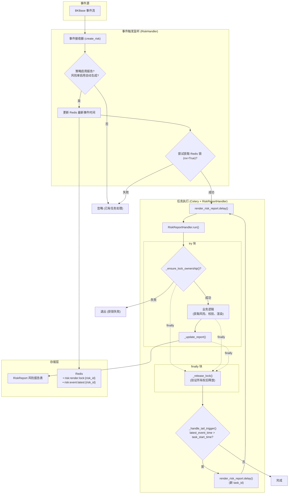

# 基于 redis 的任务防抖+尾部触发

## 1. 模块概述

### 1.1 模块职责

本模块负责**事件自动触发单据渲染**的核心功能，包括：

1. **事件触发监听**：监听新事件到来，判断是否需要触发报告渲染
2. **渲染任务触发**： celery 异步任务
3. **渲染器服务封装**：封装渲染器服务调用，传递风险、事件等数据
4. **渲染结果处理**：查询渲染结果并更新报告内容

### 1.2 系统架构与锁机制设计 (Phase 2.1 更新: 精简重构)

#### 1.2.1 架构概述



**关键变更点**：

- **直接触发**：Handler 直接触发 Celery 任务，而非定时轮询。
- **防抖机制**：

  - **锁** (`risk:render:lock:{risk_id}`)：防止并发任务。
  - **尾部触发** (`risk:event:latest:{risk_id}`)：任务结束时检查是否有新事件，如有则递归触发。

#### 1.2.2 设计原则

**核心思路**：任务内只关心"我有没有锁"，结束后统一释放锁。

```
三种触发场景统一处理：
- 首次触发：trigger_render_task() 获锁 → delay()
- 尾部触发：finally 释放锁 → _handle_tail_trigger() → delay() → 新任务 _ensure_lock_ownership()
- 重试触发：Celery retry() → 新任务 _ensure_lock_ownership()
```

**设计优势**：

1. **锁释放统一**：只在 `finally` 中释放，不散落在业务逻辑各处
2. **获锁逻辑统一**：`_ensure_lock_ownership()` 同时处理"续期"和"新获取"
3. **尾部触发简洁**：直接用 `render_risk_report.delay()`，新任务自己竞争锁
4. **重试自洽**：和尾部触发走同一套逻辑

#### 1.2.3 核心方法设计

​ **​`_ensure_lock_ownership()`​** ​  **- 验证/获取锁**

```python
def _ensure_lock_ownership(self) -> bool:
    """
    验证锁所有权，如果锁不存在则尝试获取
    
    场景：
    1. 锁属于自己 → 续期并返回 True
    2. 锁不存在 → 尝试获取（nx=True 防止并发）
    3. 锁被他人持有 → 返回 False
    """
    current_lock = cache.get(self.lock_key)
    
    if current_lock == self.task_id:
        # 锁属于自己，续期
        cache.set(self.lock_key, self.task_id, timeout=settings.RENDER_TASK_TIMEOUT)
        return True
    elif current_lock is None:
        # 锁不存在，尝试获取（nx=True 防止并发）
        return cache.set(self.lock_key, self.task_id, nx=True, timeout=settings.RENDER_TASK_TIMEOUT)
    
    # 锁被他人持有
    return False
```

​**​`run()`​** ​  **- 主流程（使用 try-finally）**

```python
def run(self):
    try:
        if not self._ensure_lock_ownership():
            return
        
        # 业务逻辑...
        risk = self._get_risk()
        if not risk or not risk.can_generate_report():
            return
        
        report_content = self._render_report(risk)
        
        risk.refresh_from_db()
        if not risk.can_generate_report():
            return
        
        self._update_report(content=report_content)
        
    finally:
        # 统一释放锁
        self._release_lock()
    
    # 正常完成后检查尾部触发（在 finally 之后执行）
    self._handle_tail_trigger()
```

​ **​`_handle_tail_trigger()`​** ​  **- 尾部触发（简化版）**

```python
def _handle_tail_trigger(self):
    """
    处理尾部触发：检查是否有新事件，直接触发新任务
    
    注意：此方法在 finally 释放锁之后调用，新任务需要自己竞争锁
    """
    latest_event_time = cache.get(self.latest_event_time_key)

    if latest_event_time and float(latest_event_time) > self.task_start_time:
        # 直接触发新任务，新任务会自己获取锁
        from services.web.risk.tasks import render_risk_report
        render_risk_report.delay(risk_id=self.risk_id, task_id=str(uuid.uuid4()))
```

#### 1.2.4 场景自洽性验证

|场景|描述|流程|是否自洽|
| ----| ----------------| -------------------------------------------------------| --------|
|1|首次事件触发|​`trigger_render_task()` 获锁 → Task-A 执行 → 完成释放锁|✅|
|2|尾部触发|Task-A finally 释放锁 → 触发 Task-B → Task-B 自己获锁|✅|
|3|异常 + 重试|Task-A 异常 → finally 释放锁 → 重试 Task-A 自己获锁|✅|
|4|重试期间有新事件|Task-B 先获锁 → Task-A(retry) 获锁失败退出|✅|
|5|最大重试次数耗尽|发送告警 → 检查尾部触发|✅|
|6|锁 TTL 过期|Task-B 获锁成功 → Task-A 完成后不误删 Task-B 的锁|✅|
|7|业务校验失败|不触发尾部任务（符合预期）|✅|

#### 1.2.5 详细场景演练

**场景 2：任务执行期间有新事件（尾部触发）**

```
时间线：
T0: 事件 E1 → Task-A 获锁执行
T1: 事件 E2 到达 → trigger_render_task() 获锁失败 → 更新 latest_event_time
T2: 事件 E3 到达 → 同上
T3: Task-A 完成 → finally 释放锁
T4: _handle_tail_trigger() 检测到 latest_event_time > task_start_time
T5: 触发 Task-B.delay(new_task_id)
T6: Task-B 执行 _ensure_lock_ownership() → 锁为空 → nx=True 获锁 ✅
T7: Task-B 渲染最新数据（包含 E1+E2+E3）
```

**场景 4：重试期间有新事件**

```
时间线：
T0: Task-A 异常 → 释放锁 → 等待重试
T1: 新事件 E2 到达 → trigger_render_task() 获锁成功 → Task-B delay()
T2: Task-B 执行 → 获锁 ✅
T3: Celery 重试 Task-A
T4: Task-A(retry) 执行 _ensure_lock_ownership() → 锁被 Task-B 持有 → 返回 False
T5: Task-A(retry) 直接退出
T6: Task-B 正常完成，渲染最新数据
```

**场景 6：尾部触发时的并发竞争**

```
时间线：
T0: Task-A 完成 → finally 释放锁
T1: (并发) 新事件 E4 到达 → trigger_render_task() 尝试获锁
T2: (并发) Task-A 执行 _handle_tail_trigger() → Task-B.delay()
T3: 两个任务竞争锁：
    - 情况 A：E4 先获锁 → Task-E4 执行，Task-B 获锁失败退出
    - 情况 B：Task-B 先获锁 → Task-B 执行，E4 的 trigger 失败（更新 latest_event_time）

无论谁胜出，最终都会渲染最新数据 ✅
```

**场景 7：锁 TTL 过期（任务执行超时）**

```
时间线：
T0: Task-A 获锁（TTL=300s）
T1-T300: Task-A 执行中
T300: 锁自动过期
T301: 新事件 E2 → trigger_render_task() 获锁成功 → Task-B
T302: Task-B 执行
T350: Task-A 终于完成 → finally _release_lock()
T351: cache.get(lock_key) != Task-A.task_id → 不删除锁 ✅
T352: Task-A 执行 _handle_tail_trigger() → 触发 Task-C
T353: Task-C 执行 _ensure_lock_ownership() → 锁被 Task-B 持有 → 退出

关键点：_release_lock() 有所有权验证，不会误删 Task-B 的锁 ✅
```
